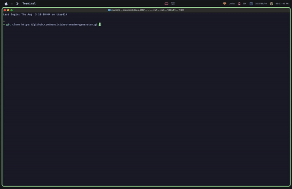

# Professional README Generator

## Description

A CLI application that generates README.md files.

## Table of Contents

-   [Installation](#installation)
-   [Usage](#usage)
-   [Credits](#credits)
-   [License](#license)

## Installation

1. Open your terminal
2. `git clone https://github.com/manc1n1/pro-readme-generator.git`
3. `cd pro-readme-generator`
4. `npm install`
5. `node index.js`
6. Answer the prompts
7. Open `README.md`

## Usage

## Credits

-   [How to create a Professional README](https://coding-boot-camp.github.io/full-stack/github/professional-readme-guide)
-   [Best-README-Template](https://github.com/othneildrew/Best-README-Template/tree/master)
-   [Bootcamp Starter Code](https://github.com/coding-boot-camp/potential-enigma)

## License

---

## Contributing

Contributions are what make the open source community such an amazing place to learn, inspire, and create. Any contributions you make are **greatly appreciated**.

If you have a suggestion that would make this better, please fork the repo and create a pull request. You can also simply open an issue with the tag "enhancement".
Don't forget to give the project a star! Thanks again!

1. Fork the Project
2. Create your Feature Branch (`git checkout -b feature/AmazingFeature`)
3. Commit your Changes (`git commit -m 'Add some AmazingFeature'`)
4. Push to the Branch (`git push origin feature/AmazingFeature`)
5. Open a Pull Request
